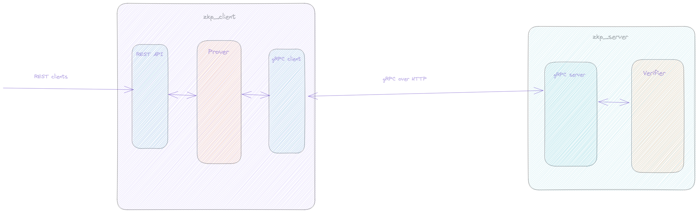
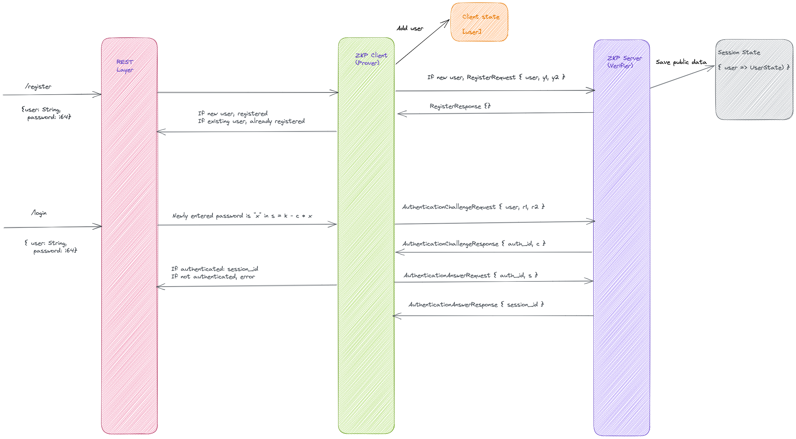

## An authentication system implemented using ZKP (Chaum-Pedersen) protocol


### Design

The overall application is designed in terms of three main modules:

  1. The REST interface for external clients (`curl`, HTTP clients et al).

  2. The gRPC Authentication Client. This talks to the gRPC authentication server.

  3. The gRPC Authentication Server. This serves requests from the gRPC authentication client.

Please refer to the following diagram for the overall architecture of the solution:




#### Approach

The solution uses the Chaum-Pedersen ZKP protocol (as mentioned on page 377 of Nigel Smart's book). The implementation of the algorithm itself is described succinctly as follows:

  * Select the prime as p = 2^255 - 19 (Curve25519, 128 bits).

  * Select the generators g = 5, h = 3.

  * Prover generates (y1, y2) = (g ^ x mod p, h ^ x mod p), where 'x' is the secret value (saved during user registration).

  * Public knowledge - (y1, y2, p) shared between prover and verifier. (`p`, `g`, and `h` are pre-determined during setup, `y1` and `y2` are passed from auth client to auth server).

  * Prover generates a random value k (in the range [0, p - 1]). (a random 128-bit value in our case).

  * Prover sends (r1, r2) = (g ^ k mod p, h ^ k mod p) to the Verifier.

  * Verifier notes these values and generates a random value k (in the range [0, p - 1]). (a random 128-bit value in our case).
    This is sent to this to the Prover.

  * Prover then sends across value s = (k - c * x) mod p. Sends this to the Verifier. (Note: The password entered by the user (not the original registration secret) now takes the role of `x` instead of the registration secret, 
    and if the newly entered password and the registration secret match up, authentication will pass otherwise fail. This is how the protocol can be used for authentication).

  * Verifier computer (r1', r2') = ((g ^ s . y1 ^ c) mod p, (h ^ s . y2 ^ c) mod p).

  * If (r1, r2) == (r1', r2') then verified else not verified.

The overall flow of control across the application can be best understood by the following sequence diagram:




#### Features

   * Unit tests, where appropriate [❌] (Comment: I feel that integration tests (using an external script) would be the best way to test this application . Mocking doesn't really make sense here since the whole application 
     is basically a server. The gRPC server could possibly be mocked - these could be done as enhancements).

   * Functional test of the ZKP Protocol [❌] (Same comment as above)

   * A setup to run the Client and the Server. [i✅]

   * Use Rust as language for the implementation [✅]

   * Performance and optimizations [❌]

  *  Well documented code [✅] (Comment: I have documented key parts of the flow, but I firmly believe that, *ceteris paribus*, code should be self-documenting - though this does depend on knowledge of the domain as well).

  *  Each instance runs in a separated docker container and have a docker compose to run
the setup [✅]

  *  There is code to deploy the two containers in AWS. The client in one machine and the
server in another machine [❌] (Comment: I don't have access to AWS unfortunately. However, I think this shouldn't be too difficult to implement).

  *  Implement two flavor: One with exponentiations (as described in the book) and one
using Elliptic Curve cryptography (see for example this ZKP implementation in Rust) [i❌] 
  (Comment: The Chaum-Pedersen protocol was simple enough, but it led me down a rabbit-hole of primes, cyclic orders, and lots of number theoretical concepts that, while interesting, diverted
 my attention from the protocol itself. Now that the basic discrete logarithmic protocol has been implemented, implementing the elliptic curve approach (from what I sunderstand) shouldn't be too hard, but maybe as an enhacement).

   * Allow using “BigInt” numbers [i✅4] (Comment: This necessitated a change in the protobuf definition, updating `int64` to `string`. I tried using `bytes`, but ran into problems with `num_bigint` (the Rust bigint crate)).


#### Limitations

  * Not comprehensive error-handling. A lot of corner cases that would be handled in production have been taken for granted (such as `unwrap`ping values in the intermediate modules. The REST interface should provide some protection against
  invalid data being passed in though).

  * Automated integration tests for end-to-end testing of the whole application is missing. As noted before, this could be implemented using an external script to test against a live instance of the server.

  * Assumptions were made about the values for the prime number and the generators based on my own research. 

  * The solution only reads in big int passwords. Any password could be accepted by choosing a relevant encoding system that converts an arbitrary string password into numnbers.


### Build and Run

#### Manual

The project is modeled as a `Cargo` workspace with two sub-projects - `zkp_client` for the auth client, and `zkp_server` for the auth server.

To build and run on the command-line, we can start the server and client as follows:

```
  $ cd zkp_client
  $ cargo run --release
```

and likewise, for the server:

```
`$ cd zkp_server
 # cargo run --release`
```

Sample run:

```
 $ curl -X POST -H 'Content-Type: application/json' -d '{"user" : "Bob", "password": "987374283748273489274823748723479283748274827348724000000010101818716768263263462348627462783467236427346273467286472634786238267"}' localhost:8888/register | jq
  % Total    % Received % Xferd  Average Speed   Time    Time     Time  Current
                                 Dload  Upload   Total   Spent    Left  Speed
100   197  100    36  100   161   1766   7902 --:--:-- --:--:-- --:--:-- 11588
{
  "user": "Bob",
  "status": "registered"
}

$ curl -X POST -H 'Content-Type: application/json' -d '{"user" : "Bob", "password": "987374283748273489274823748723479283748274827348724000000010101818716768263263462348627462783467236427346273467286472634786238267"}' localhost:8888/register | jq
  % Total    % Received % Xferd  Average Speed   Time    Time     Time  Current
                                 Dload  Upload   Total   Spent    Left  Speed
100   205  100    44  100   161  14652  53613 --:--:-- --:--:-- --:--:--  200k
{
  "user": "Bob",
  "status": "already registered"
}

$ curl -X POST -H 'Content-Type: application/json' -d '{"user" : "Bob", "password": "987374283748273489274823748723479283748274827348724000000010101818716768263263462348627462783467236427346273467286472634786238267"}' localhost:8888/login | jq
  % Total    % Received % Xferd  Average Speed   Time    Time     Time  Current
                                 Dload  Upload   Total   Spent    Left  Speed
100   253  100    92  100   161  13782  24119 --:--:-- --:--:-- --:--:-- 84333
{
  "user": "Bob",
  "status": "authenticated",
  "session_id": "3752165018859329260023369613569098311"
}

$ curl -X POST -H 'Content-Type: application/json' -d '{"user" : "Bob", "password": "987374283748273489274823748723479283748274827348724000000010101818716768263263462348627462783467236427346273467286472634786238267"}' localhost:8888/login | jq
  % Total    % Received % Xferd  Average Speed   Time    Time     Time  Current
                                 Dload  Upload   Total   Spent    Left  Speed
100   255  100    94  100   161  16187  27725 --:--:-- --:--:-- --:--:-- 85000
{
  "user": "Bob",
  "status": "authenticated",
  "session_id": "148289958268247228080745059635639648264"
}

$ curl -X POST -H 'Content-Type: application/json' -d '{"user" : "Bob", "password": "987374283748273489274823748723479283748274827348724000000010101818716768263263462348627462783467236427346273"}' localhost:8888/login | jq
  % Total    % Received % Xferd  Average Speed   Time    Time     Time  Current
                                 Dload  Upload   Total   Spent    Left  Speed
100   230  100    90  100   140  18119  28186 --:--:-- --:--:-- --:--:--  112k
{
  "user": "Bob",
  "status": "not authenticated - user authentication failed",
  "session_id": null
}

$ curl -X POST -H 'Content-Type: application/json' -d '{"user" : "Bob", "password": "987374283748273489274823748723479283748274827348724000000010101818716768263263462348627462783467236427346273467286472634786238267"}' localhost:8888/login | jq
  % Total    % Received % Xferd  Average Speed   Time    Time     Time  Current
                                 Dload  Upload   Total   Spent    Left  Speed
100   255  100    94  100   161  14133  24206 --:--:-- --:--:-- --:--:-- 63750
{
  "user": "Bob",
  "status": "authenticated",
  "session_id": "253549769972436493508674358285510843837"
} 

```


#### Using Docker

From the project root (the `zkp_chaum_pedersen` directory), run the following commands.

To start the server:

```
  $ docker compose build zkp_server
  $ docker compose up zkp_server
```

To start the client:

```
  $ docker compose build zkp_client
  $ docker compose up zkp_client
```

Sample run:


```
$ curl -X POST -H 'Content-Type: application/json' -d '{"user" : "Amanda", "password": "12345"}' localhost:8888/register | jq
  % Total    % Received % Xferd  Average Speed   Time    Time     Time  Current
                                 Dload  Upload   Total   Spent    Left  Speed
100    79  100    39  100    40   2001   2052 --:--:-- --:--:-- --:--:--  4937
{
  "user": "Amanda",
  "status": "registered"
}
$ curl -X POST -H 'Content-Type: application/json' -d '{"user" : "Amanda", "password": "12345"}' localhost:8888/register | jq
  % Total    % Received % Xferd  Average Speed   Time    Time     Time  Current
                                 Dload  Upload   Total   Spent    Left  Speed
100    87  100    47  100    40  15708  13368 --:--:-- --:--:-- --:--:-- 87000
{
  "user": "Amanda",
  "status": "already registered"
}
$ curl -X POST -H 'Content-Type: application/json' -d '{"user" : "Bob", "password": "000191"}' localhost:8888/register | jq
  % Total    % Received % Xferd  Average Speed   Time    Time     Time  Current
                                 Dload  Upload   Total   Spent    Left  Speed
100    74  100    36  100    38   7312   7718 --:--:-- --:--:-- --:--:-- 74000
{
  "user": "Bob",
  "status": "registered"
}
$ curl -X POST -H 'Content-Type: application/json' -d '{"user" : "Bob", "password": "000191"}' localhost:8888/register | jq
  % Total    % Received % Xferd  Average Speed   Time    Time     Time  Current
                                 Dload  Upload   Total   Spent    Left  Speed
100    82  100    44  100    38  12077  10430 --:--:-- --:--:-- --:--:-- 82000
{
  "user": "Bob",
  "status": "already registered"
}
$ curl -X POST -H 'Content-Type: application/json' -d '{"user" : "Bob", "password": "000191"}' localhost:8888/login | jq
  % Total    % Received % Xferd  Average Speed   Time    Time     Time  Current
                                 Dload  Upload   Total   Spent    Left  Speed
100   132  100    94  100    38  15030   6076 --:--:-- --:--:-- --:--:-- 44000
{
  "user": "Bob",
  "status": "authenticated",
  "session_id": "160095994444703416409432959075462322905"
}
$ curl -X POST -H 'Content-Type: application/json' -d '{"user" : "Bob", "password": "12345"}' localhost:8888/login | jq
  % Total    % Received % Xferd  Average Speed   Time    Time     Time  Current
                                 Dload  Upload   Total   Spent    Left  Speed
100   127  100    90  100    37  18820   7737 --:--:-- --:--:-- --:--:-- 63500
{
  "user": "Bob",
  "status": "not authenticated - user authentication failed",
  "session_id": null
}

```

